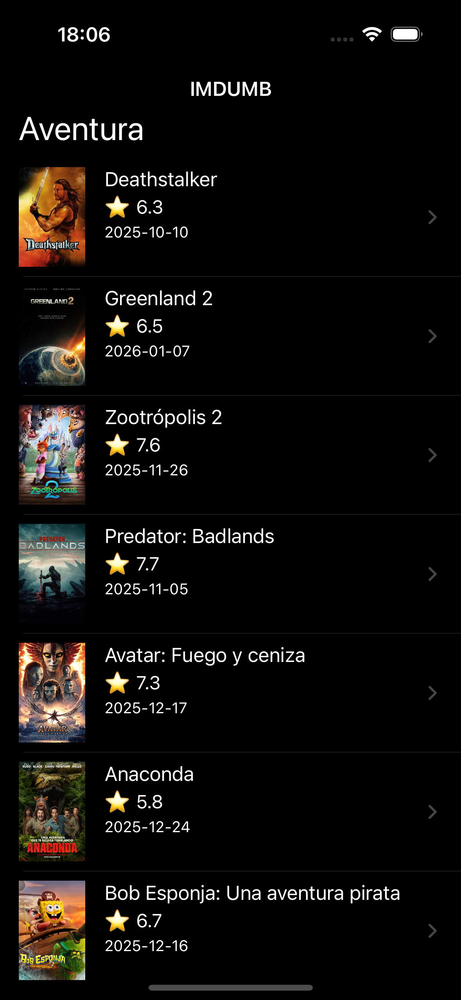
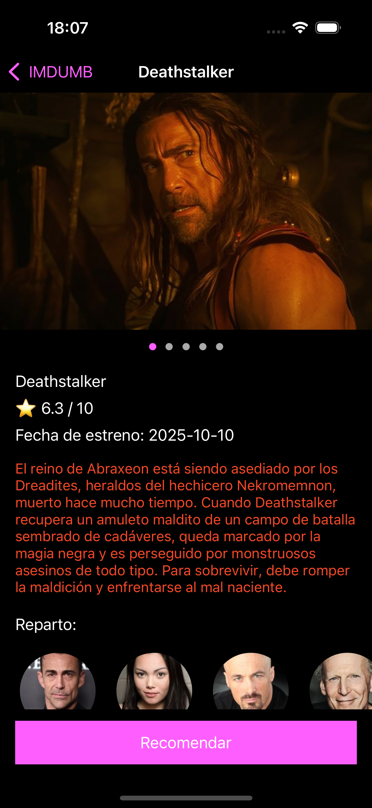
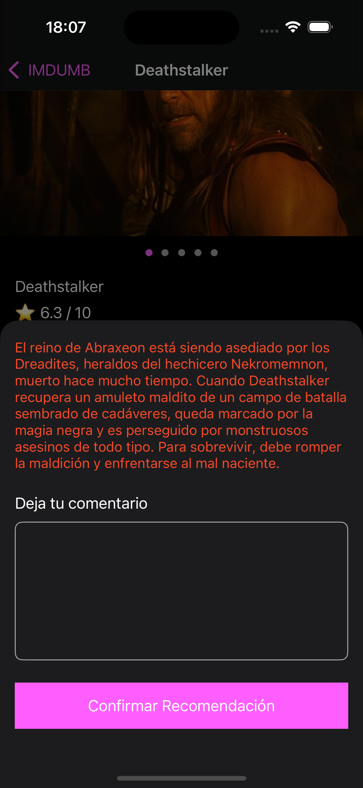
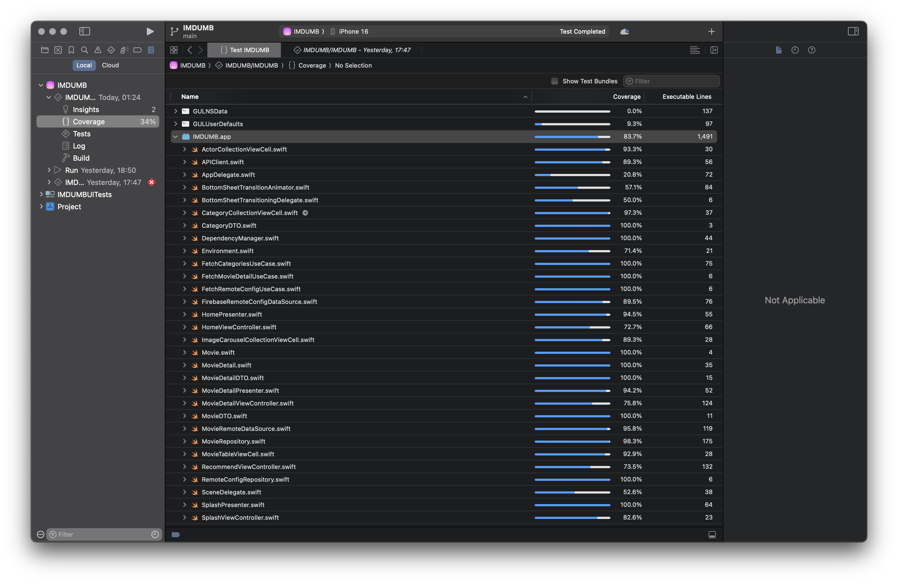
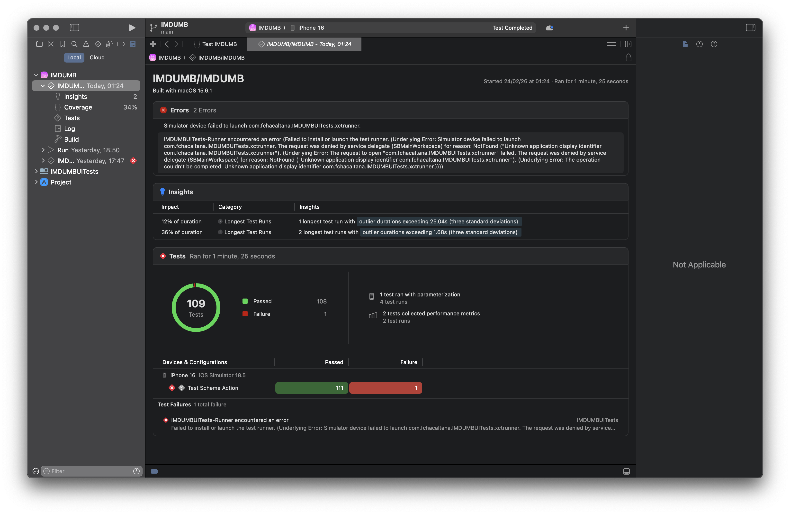

# IMDUMB


iOS App que consume la API de [The Movie Database (TMDB)](https://www.themoviedb.org/) para mostrar categorías de películas, detalles, imágenes, reparto y permite recomendar películas mediante un bottom sheet. Utiliza Firebase Remote Config para configuración remota.

---

## Capturas de pantalla

| Splash | Home | Detalle | Recomendar |
|--------|------|---------|------------|
|  |  |  |  |

> 1. **Splash** — Pantalla de carga con mensaje de bienvenida y spinner.
> 2. **Home** — Lista de categorías con películas (collection view con celdas).
> 3. **Detalle de película** — Carrusel de imágenes, rating ⭐, sinopsis HTML, reparto.
> 4. **Bottom sheet de recomendación** — Campo de texto con límite de 500 caracteres y botón confirmar.
> 5. **GIF del flujo completo** — Splash → Home → Detalle → Recomendar → Alerta de éxito → Volver.

---

## Arquitectura

**MVP (Model-View-Presenter)** con separación en capas siguiendo **Clean**:

```
App/                  → AppDelegate, SceneDelegate, DI (DependencyManager)
Domain/
  ├── Entities/       → Movie, MovieDetail, Category, Actor, MovieImage
  ├── UseCases/       → FetchCategoriesUseCase, FetchMovieDetailUseCase, FetchRemoteConfigUseCase
  └── Repositories/   → Protocolos (MovieRepositoryProtocol, RemoteConfigRepositoryProtocol)
Data/
  ├── DTOs/           → CategoryDTO, MovieDTO, MovieDetailDTO, ActorDTO, MovieImageDTO
  ├── DataSources/    → APIClient, MovieRemoteDataSource, FirebaseRemoteConfigDataSource
  └── Repositories/   → MovieRepository, RemoteConfigRepository
Presentation/
  ├── Splash/         → SplashViewController + SplashPresenter
  ├── Home/           → HomeViewController + HomePresenter
  ├── MovieDetail/    → MovieDetailViewController + MovieDetailPresenter
  └── Recommend/      → RecommendViewController (BottomSheet)
```

---

## Tech Stack y Dependencias (SPM)

| Dependencia | Versión | Uso |
|---|---|---|
| **Alamofire** | 5.10.x | Cliente HTTP para consumir la API de TMDB |
| **Firebase iOS SDK** | 11.x | Remote Config |
| **Xcode** | 16.2+ | IDE de desarrollo |
| **iOS Deployment Target** | 16.0+ | Versión mínima soportada |
| **Swift** | 5.9+ | Lenguaje de programación |

---

## Cómo correr el proyecto

### Prerrequisitos
- **macOS** Ventura 13.0 o superior
- **Xcode** 16.2 o superior

### Pasos

```bash
# 1. Clonar el repositorio
git clone https://github.com/lazymisu/IMDUMB.git
cd IMDUMB

# 2. Abrir el proyecto
open IMDUMB.xcodeproj
```
3. **Compilar y ejecutar:**
   - Selecciona un simulador (iPhone 15 Pro recomendado).
   - `Cmd + R` para compilar y ejecutar.

---

## Endpoints usados (TMDB API v3)

| Endpoint | Descripción |
|---|---|
| `GET /genre/movie/list` | Lista de géneros/categorías |
| `GET /discover/movie?with_genres={id}` | Películas por género |
| `GET /movie/{id}` | Detalle de una película |
| `GET /movie/{id}/images` | Imágenes |
| `GET /movie/{id}/credits` | Actores |

Todos los endpoints se consumen con el parámetro `language=es-ES` y `api_key` inyectado automáticamente por `APIClient`.

### Mocks para testing

Los tests unitarios no requieren conexión a red. Se usan mocks que implementan los protocolos de data source, repositorios y use cases. Ver `IMDUMBTests`.

---

## Principios SOLID

La documentación de los principios SOLID aplicados se encuentra directamente en el código fuente mediante comentarios. A continuación un resumen de dónde encontrarlos:

| Principio | Archivo(s) | Descripción |
|---|---|---|
| **S** — Single Responsibility | `SplashPresenter.swift`, `MovieRepository.swift` | Cada clase tiene una única responsabilidad |
| **O** — Open/Closed | `APIClient.swift`, protocolos de Use Cases | Extensibles sin modificar código existente |
| **D** — Dependency Inversion | `DependencyManager.swift`, Presenters | Se depende de abstracciones (protocolos), no de implementaciones concretas |

Ver la sección de comentarios `// MARK: - SOLID` en cada archivo referenciado.

---

## Tests





```bash
# Unit Tests
Cmd + U  # en Xcode, o Product → Test

# UI Tests
# Seleccionar el esquema IMDUMBUITests y ejecutar Cmd + U
```

---

Reto técnico hecho por Felix Chacaltana.
